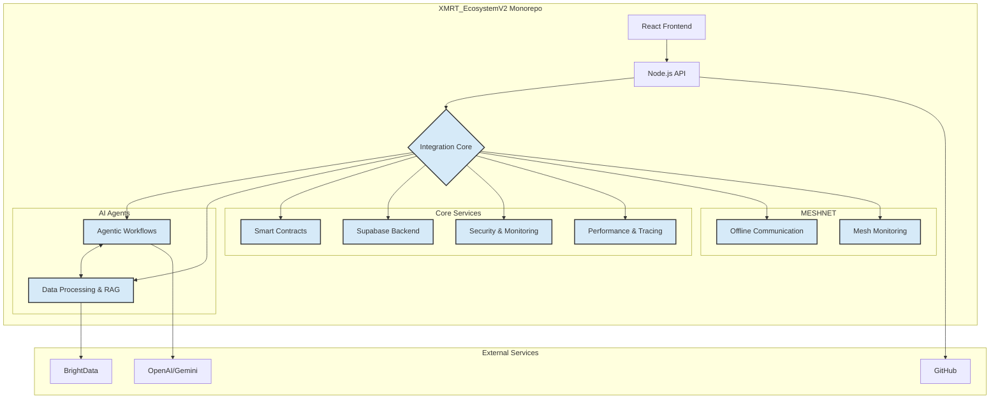

# XMRT Ecosystem V2 - Enhanced Monorepo

**Author**: Manus AI & Joseph Andrew Lee (DevGruGold)
**Version**: 2.0.0

## 🚀 The Future of Decentralized Financial Freedom

Welcome to **XMRT Ecosystem V2**, the comprehensive monorepo for the XMRT (Monero Mobile Mining) ecosystem. This repository represents a significant leap forward in our mission to democratize access to cryptocurrency and decentralized finance through innovative mobile-first solutions. By consolidating over 30 specialized repositories into a single, cohesive monorepo, we have created a powerful, unified platform for decentralized mobile Monero mining, autonomous DAO governance, and secure, privacy-focused financial applications.

This enhanced ecosystem is built on a foundation of cutting-edge technologies, including:

*   **Advanced AI Agents**: Autonomous agents for coordination, data analysis, and system management.
*   **High-Performance Visualization**: Real-time dashboards for monitoring mining operations, DAO governance, and network health.
*   **Robust Security**: Comprehensive security monitoring and zero-knowledge proofs for enhanced privacy.
*   **Offline MESHNET**: Groundbreaking technology for mobile Monero mining, even without internet connectivity.

## 🎯 Core Components & Integrated Services

The `XMRT_EcosystemV2` monorepo is organized into a modular architecture, with core components and integrated services managed by a central **Integration Core**. This ensures seamless communication and data flow between all parts of the ecosystem.

### Architectural Overview



### Key Integrated Packages

| Package | Description | Integration Status |
|---|---|---|
| **`@xmrt/integration-core`** | Central coordination hub for all integrated packages | ✅ **Active** |
| **`xmrt-supabase`** | Database, real-time, and authentication services | ✅ **Active** |
| **`xmrt-activepieces`** | No-code workflow automation and AI agent integration | ✅ **Active** |
| **`xmrt-agno`** | High-performance runtime for multi-agent systems | ✅ **Active** |
| **`xmrt-gov-ui-kit`** | Specialized UI components for DAO governance | ✅ **Active** |
| **`xmrt-RAG-Anything`** | Multimodal RAG for intelligent data processing | ✅ **Active** |
| **`xmrt-wazuh`** | Comprehensive security monitoring and threat detection | ✅ **Active** |
| **`xmrt-risc0-proofs`** | Zero-knowledge proofs for enhanced privacy and security | ✅ **Active** |
| **`xmrt-AirCom-ESP32-wifi-halow`** | Offline MESHNET communication for mobile mining | ✅ **Active** |

## 🛠️ Getting Started

### Prerequisites

*   Node.js (v16 or higher)
*   npm (v8 or higher)
*   Docker (for running Supabase and other services locally)

### Installation

1.  **Clone the repository**:

    ```bash
    git clone https://github.com/DevGruGold/XMRT_EcosystemV2.git
    cd XMRT_EcosystemV2
    ```

2.  **Install dependencies**:

    ```bash
    npm install
    ```

3.  **Set up environment variables**:

    Create a `.env` file in the root of the project and add the necessary environment variables for Supabase, OpenAI, and other services.

### Running the Ecosystem

1.  **Start the backend services**:

    ```bash
    npm run start:api
    ```

2.  **Start the frontend application**:

    ```bash
    npm run start:web
    ```

3.  **Access the dashboard**:

    Open your browser and navigate to `http://localhost:3000` to view the enhanced XMRT Ecosystem V2 dashboard.

## 📚 Documentation

For more detailed information about the architecture, integration plan, and individual components, please refer to the following documents:

*   **[Integration & Enhancement Design](docs/integration_design.md)**: A comprehensive overview of the integration strategy and architectural design.
*   **[XMRT Ecosystem Analysis](docs/xmrt_ecosystem_analysis.md)**: A detailed analysis of the 30+ repositories that form the XMRT ecosystem.

## 🤝 Contributing

We welcome contributions from the community! If you would like to contribute to the XMRT Ecosystem V2, please follow these steps:

1.  Fork the repository.
2.  Create a new branch for your feature or bug fix.
3.  Make your changes and commit them with a clear and descriptive message.
4.  Push your changes to your fork.
5.  Create a pull request to the `main` branch of this repository.

## 📄 License

This project is licensed under the MIT License. See the [LICENSE](LICENSE) file for more details.

