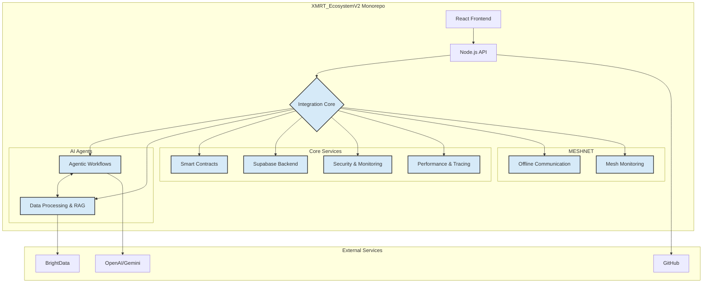

# XMRT Ecosystem V2 Integration & Enhancement Design

**Author**: Manus AI  
**Date**: October 1, 2025  
**Version**: 1.0

## 1. Introduction

This document outlines the design for the integration and enhancement of the **XMRT_EcosystemV2** monorepo. The goal is to consolidate the distributed XMRT ecosystem of 30+ specialized repositories into a single, cohesive, and powerful monorepo. This will create a unified platform for decentralized mobile Monero mining, autonomous DAO governance, and secure, privacy-focused financial applications.

This integration will leverage the existing monorepo structure of `XMRT_EcosystemV2` and enhance it by incorporating the core functionalities from the specialized repositories, including agentic workflows, advanced data processing, high-performance visualization, robust security, and offline MESHNET capabilities.

## 2. High-Level Architecture

The enhanced `XMRT_EcosystemV2` will be a fully integrated monorepo with a modular architecture. The core components will be organized into distinct packages and applications within the existing `apps`, `packages`, and `ai-agents` directories. A central **Integration Core** will manage the communication and data flow between the different components.

### Architectural Diagram

This diagram illustrates the high-level architecture of the integrated `XMRT_EcosystemV2` monorepo, showcasing the interaction between the frontend, backend, AI agents, core services, and the MESHNET components.

## 3. Detailed Integration Plan

### 3.1. Agentic Workflows & Automation

**Objective**: Enhance the `ai-agents` package with advanced agentic capabilities from the specialized repositories.

**Integration Steps**:
1.  **Integrate `xmrt-activepieces` and `xmrt-n8n`**: The no-code workflow automation capabilities will be integrated into a new `automation` service within the `packages` directory. This service will expose a simple API for defining and triggering workflows.
2.  **Integrate `xmrt-agno` and `xmrt-DeepMCPAgent`**: The core agent runtime and coordination logic will be integrated into the `ai-agents` package. This will replace the existing placeholder agent implementation with a robust, multi-agent system.
3.  **Integrate `xmrt-agents-towards-production`**: The production-ready agent frameworks, including Redis and Streamlit for persistent UIs, will be used to build a new `agent-dashboard` application in the `apps` directory.

### 3.2. Data Processing & RAG

**Objective**: Create a powerful data processing pipeline for mining analytics and DAO governance.

**Integration Steps**:
1.  **Integrate `xmrt-firecrawl` and `xmrt-brightdata-mcp`**: A new `data-ingestion` service will be created in the `packages` directory to handle web scraping and data extraction.
2.  **Integrate `xmrt-RAG-Anything` and `xmrt-RAGLight`**: The RAG capabilities will be integrated into the `ai-agents` package to provide agents with the ability to perform grounded, multimodal queries.
3.  **Integrate `xmrt-langextract`**: The language extraction and visualization features will be integrated into the `agent-dashboard` to provide rich, interactive data analysis.

### 3.3. Visualization & UI

**Objective**: Enhance the React frontend with specialized governance and mining visualization components.

**Integration Steps**:
1.  **Integrate `xmrt-gov-ui-kit`**: The governance UI components will be integrated into the `apps/web` application to provide a rich, interactive interface for DAO governance.
2.  **Integrate `xmrt-MeshSentry`**: The mesh network monitoring dashboards will be integrated into a new `mesh-dashboard` application in the `apps` directory.
3.  **Integrate `xmrt-filament-render-engine` and `xmrt-dawn-native-webgpu`**: The high-performance rendering engines will be used to create a new `3d-visualization` package for advanced mining and network analytics.

### 3.4. Security & Monitoring

**Objective**: Implement a comprehensive security and monitoring solution for the entire ecosystem.

**Integration Steps**:
1.  **Integrate `xmrt-wazuh`**: The security monitoring and threat detection capabilities will be integrated into a new `security-service` in the `packages` directory.
2.  **Integrate `xmrt-risc0-proofs`**: The zero-knowledge proof capabilities will be integrated into the `contracts` and `api` to provide enhanced privacy and security for financial transactions and DAO voting.
3.  **Integrate `xmrt-autoswagger`**: The API security scanning capabilities will be integrated into the CI/CD pipeline to ensure the security of all API endpoints.

### 3.5. Performance & Infrastructure

**Objective**: Implement the MESHNET functionality and optimize the performance of mobile mining.

**Integration Steps**:
1.  **Integrate `xmrt-AirCom-ESP32-wifi-halow`**: The offline mesh communication capabilities will be integrated into the `apps/mobile` application and a new `mesh-service` in the `packages` directory.
2.  **Integrate `xmrt-perfetto-tracing`**: The performance monitoring and tracing capabilities will be integrated into the `api` and `mobile` applications to provide detailed performance analytics.

### 3.6. Development & Learning

**Objective**: Provide a robust development and learning environment for the XMRT ecosystem.

**Integration Steps**:
1.  **Integrate `xmrt-supabase`**: The Supabase backend will be used as the primary database and real-time infrastructure for the entire ecosystem.
2.  **Integrate `xmrt-rust`**: The Rust-based components will be integrated into the `packages` directory to provide high-performance, secure services.
3.  **Integrate `xmrt-grain-ml-train`**: The machine learning training datasets will be used to train and improve the AI agents.

